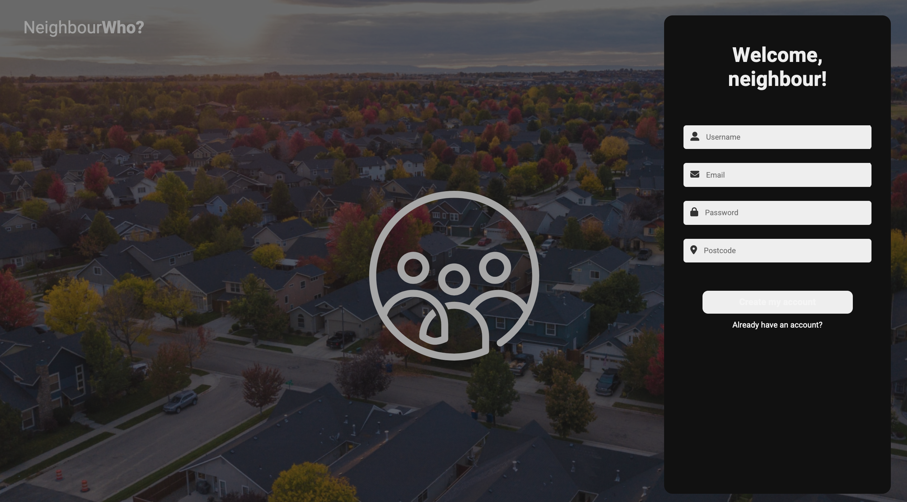

# NeighbourWho? 

NeighbourWho? is a social media application that automatically groups users with their neighbours so that posts and comments are relevant all of the time.

 

## Table of contents
* [General Information](#generalInfo)
  * [Collaborators](#collaborators)
* [Usage](#usage)
  * [Screenshots](#screenshots)
* [Technologies](#technologies)
* [API's and Data](#apis)

## General Information 
This app was created in two weeks as part of the [Codenation Masters Web Development Bootcamp](https://wearecodenation.com/2022/04/25/master-coding/).
This repository ([RaeesaParker/neighbourhood-front/](https://github.com/RaeesaParker/neighbourhood-front/)) holds the front-end code, whilst the back-end repository can be found at [ijwilliamson/neighbourhood-backend](https://github.com/ijwilliamson/neighbourhood-backend/) . 

### Collaborators 
This project has been a collaboration between -
- [Raeesa Parker](https://github.com/RaeesaParker/)
- [Ian Williamson](https://github.com/ijwilliamson/)
- [Mayranne Nascimento](https://github.com/heydut)
- [Mishal Rayamajhi](https://github.com/Mishal12)
- [Rowan Wood](https://github.com/mrdiamonddirt/)

## Usage 
The app is hosted at [https://neighbourwho.netlify.app/](https://neighbourwho.netlify.app/). 

**To test the app without creating an account, please do one of the following -**
- Click on the "Demo" button
- Log in using the following details :  &nbsp; **username:** *testuser* &nbsp; **password:** *testuser*

If you would like to create an account, you are required to sign-up using a valid username, e-mail, password, and UK postcode. 

**Note: As this was intented to be a small project, created using limited resources, the app is currently only functional for postcodes within Preston, UK. We, thus, urge users to create a profile using one of the following postcodes - PR7 7AJ, PR7 7AR, PR7 7AT, PR7 7AU**

### Screenshots 
Below are a selection of screenshots of the app. We have included exmaples showcasing the responsiveness of the app across various devices. 

  
  
  
  
 

  

## Technologies 

### Front-end
- React 18.2 

### Back-end 
- Node.js
- Express 4.18.2
- MySQL 
- Swagger
- 
 

## API's and Data 
This app makes use of the following API's and Data -
- NHS Directory of Healthcare Services (Service Search) API
- Open Mateo Weather Forecast API 
- Regional Data from the Office of National Statistics
- UK government's Get Information About Schools Registry
